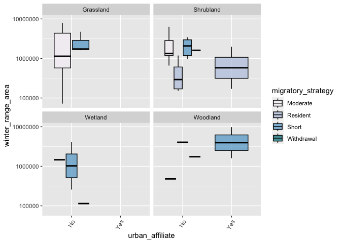

```r
library(tidyverse)
```

```
## ── Attaching core tidyverse packages ──────────────────────── tidyverse 2.0.0 ──
## ✔ dplyr     1.1.4     ✔ readr     2.1.4
## ✔ forcats   1.0.0     ✔ stringr   1.5.1
## ✔ ggplot2   3.4.4     ✔ tibble    3.2.1
## ✔ lubridate 1.9.3     ✔ tidyr     1.3.0
## ✔ purrr     1.0.2     
## ── Conflicts ────────────────────────────────────────── tidyverse_conflicts() ──
## ✖ dplyr::filter() masks stats::filter()
## ✖ dplyr::lag()    masks stats::lag()
## ℹ Use the conflicted package (<http://conflicted.r-lib.org/>) to force all conflicts to become errors
```

```r
library(janitor)
```

```
## 
## Attaching package: 'janitor'
## 
## The following objects are masked from 'package:stats':
## 
##     chisq.test, fisher.test
```

```r
library(naniar)
library(RColorBrewer)
```


```r
ecosphere <- read.csv("ecosphere.csv", na = c("NA", "")) %>% 
  clean_names()
```


```r
emberizidae <- ecosphere %>% 
  filter(family=="Emberizidae")
```


```r
miss_var_summary(emberizidae)
```

```
## # A tibble: 21 × 3
##    variable           n_miss pct_miss
##    <chr>               <int>    <dbl>
##  1 population_size         8     18.6
##  2 order                   0      0  
##  3 family                  0      0  
##  4 common_name             0      0  
##  5 scientific_name         0      0  
##  6 diet                    0      0  
##  7 life_expectancy         0      0  
##  8 habitat                 0      0  
##  9 urban_affiliate         0      0  
## 10 migratory_strategy      0      0  
## # ℹ 11 more rows
```


```r
options(scipen=999)
```


```r
emberizidae %>%
  count(habitat)
```

```
##     habitat  n
## 1 Grassland 11
## 2 Shrubland 19
## 3   Various  4
## 4   Wetland  4
## 5  Woodland  5
```


```r
 emberizidae%>%
  filter(habitat != "NA" & habitat != "Various") %>% 
  count(habitat) %>% 
  ggplot(aes(x=reorder(habitat, n), y=n, fill = habitat))+
  geom_col(color = "black", alpha=0.75)+
  scale_fill_brewer(palette = "PuBuGn")+
  labs(title = "Number of Individuals in Each Habitat",
      x="Habitat",
      y= "# of Individuals")
```

<!-- -->


```r
emberizidae %>% 
  count(migratory_strategy)
```

```
##   migratory_strategy  n
## 1           Moderate 16
## 2           Resident  7
## 3              Short 17
## 4         Withdrawal  3
```


```r
emberizidae %>% 
  count(migratory_strategy) %>% 
  ggplot(aes(x=reorder(migratory_strategy, n), y=n, fill = migratory_strategy))+
  geom_col(color = "black", alpha=0.75)+
  scale_fill_brewer(palette = "PuBuGn")+
  labs(title = "Number of Individuals with Preferred Migratory Strategy",
       x= "Migratory Strategy",
       y= "Count")
```

<!-- -->


```r
emberizidae %>% 
  filter(habitat != "NA" & habitat != "Various") %>%
  ggplot(aes(x=urban_affiliate, y=winter_range_area, fill = migratory_strategy))+
  geom_boxplot(color = "black", alpha = 0.75)+
  scale_fill_brewer(palette = "PuBuGn")+
  scale_y_log10()+
  facet_wrap(~ habitat)+
  theme(axis.text.x = element_text(angle = 60, hjust = 1))
```

<!-- -->


```r
emberizidae %>% 
  ggplot(aes(x=migratory_strategy, y=winter_range_area, fill = habitat))+
  geom_col (position = "dodge", color = "black", alpha=0.75)+
  scale_fill_brewer(palette = "PuBuGn")+
  coord_flip()
```

<!-- -->


```r
emberizidae %>% 
  ggplot(aes(x=urban_affiliate, fill = migratory_strategy))+
  geom_bar(position = "dodge", color = "black", alpha=0.75)+
  scale_fill_brewer(palette = "PuBuGn")
```

<!-- -->


```r
emberizidae %>% 
  filter(habitat != "NA" & habitat != "Various") %>%
  ggplot(aes(x=reorder(habitat, winter_range_area), y=winter_range_area, fill = habitat))+
  geom_col(position = position_dodge(width = 0.8), color = "black", alpha = 0.75, width = 0.7)+
  scale_fill_brewer(palette = "PuBuGn")+
  labs(x="habitat")
```

<!-- -->


