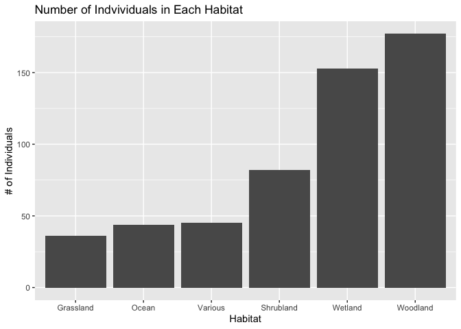
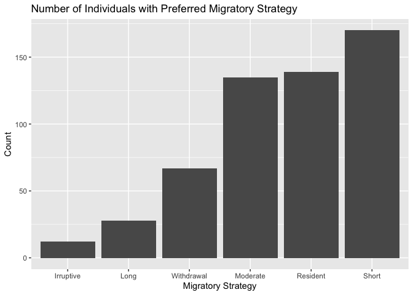
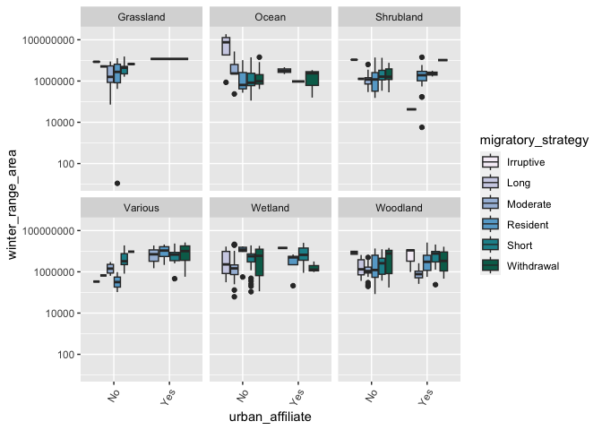
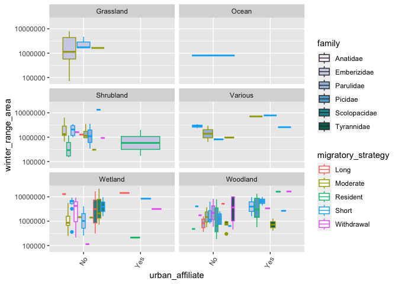

#Libraries 

```r
library(tidyverse)
```

```
## ── Attaching core tidyverse packages ──────────────────────── tidyverse 2.0.0 ──
## ✔ dplyr     1.1.4     ✔ readr     2.1.4
## ✔ forcats   1.0.0     ✔ stringr   1.5.1
## ✔ ggplot2   3.4.4     ✔ tibble    3.2.1
## ✔ lubridate 1.9.3     ✔ tidyr     1.3.0
## ✔ purrr     1.0.2     
## ── Conflicts ────────────────────────────────────────── tidyverse_conflicts() ──
## ✖ dplyr::filter() masks stats::filter()
## ✖ dplyr::lag()    masks stats::lag()
## ℹ Use the conflicted package (<http://conflicted.r-lib.org/>) to force all conflicts to become errors
```

```r
library(janitor)
```

```
## 
## Attaching package: 'janitor'
## 
## The following objects are masked from 'package:stats':
## 
##     chisq.test, fisher.test
```

```r
library(naniar)
library(RColorBrewer)
```


```r
getwd()
```

```
## [1] "/Users/jlmorale/Desktop/BIS15W2024Group_6/Ecosphere/Jocelyn"
```

# Load data

```r
ecosphere <- read.csv("ecosphere.csv", na = c("NA", "")) %>% 
  clean_names()
```


```r
miss_var_summary(ecosphere)
```

```
## # A tibble: 21 × 3
##    variable           n_miss pct_miss
##    <chr>               <int>    <dbl>
##  1 population_size       273    49.5 
##  2 habitat                14     2.54
##  3 order                   0     0   
##  4 family                  0     0   
##  5 common_name             0     0   
##  6 scientific_name         0     0   
##  7 diet                    0     0   
##  8 life_expectancy         0     0   
##  9 urban_affiliate         0     0   
## 10 migratory_strategy      0     0   
## # ℹ 11 more rows
```


```r
names(ecosphere)
```

```
##  [1] "order"                       "family"                     
##  [3] "common_name"                 "scientific_name"            
##  [5] "diet"                        "life_expectancy"            
##  [7] "habitat"                     "urban_affiliate"            
##  [9] "migratory_strategy"          "log10_mass"                 
## [11] "mean_eggs_per_clutch"        "mean_age_at_sexual_maturity"
## [13] "population_size"             "winter_range_area"          
## [15] "range_in_cbc"                "strata"                     
## [17] "circles"                     "feeder_bird"                
## [19] "median_trend"                "lower_95_ci"                
## [21] "upper_95_ci"
```

```r
options(scipen=999)
```

# Filter out Habitat

```r
ecosphere %>%
  count(habitat)
```

```
##     habitat   n
## 1 Grassland  36
## 2     Ocean  44
## 3 Shrubland  82
## 4   Various  45
## 5   Wetland 153
## 6  Woodland 177
## 7      <NA>  14
```

#Habitat

```r
ecosphere %>%
  filter(habitat != "NA") %>% 
  count(habitat) %>% 
  ggplot(aes(x=reorder(habitat, n), y=n))+
  geom_col()+
  labs(title = "Number of Indvividuals in Each Habitat",
      x="Habitat",
      y= "# of Individuals")
```

<!-- -->

# Migrator Strategy 

```r
ecosphere %>% 
  count(migratory_strategy)
```

```
##   migratory_strategy   n
## 1          Irruptive  12
## 2               Long  28
## 3           Moderate 135
## 4           Resident 139
## 5              Short 170
## 6         Withdrawal  67
```


```r
ecosphere %>%
  count(migratory_strategy) %>% 
  ggplot(aes(x=reorder(migratory_strategy, n), y=n))+
  geom_col()+
  labs(title = "Number of Individuals with Preferred Migratory Strategy",
       x= "Migratory Strategy",
       y= "Count")
```

<!-- -->


```r
ecosphere %>% 
  filter(habitat != "NA") %>%
  ggplot(aes(x=urban_affiliate, y=winter_range_area, fill = migratory_strategy))+
  geom_boxplot()+
  scale_fill_brewer(palette = "PuBuGn")+
  scale_y_log10()+
  facet_wrap(~ habitat)+
  theme(axis.text.x = element_text(angle = 60, hjust = 1))
```

<!-- -->

Do the same graph from above but for the top 5 families. 


```r
ecosphere %>%
  select(order, family, common_name, habitat, urban_affiliate, winter_range_area, migratory_strategy) %>%
  filter(habitat != "NA") %>%
  group_by(family) %>%
  summarise(individuals_per_family = n()) %>%
  arrange(desc(individuals_per_family)) %>%
  top_n(5) %>%
  inner_join(ecosphere, by = "family") %>%
  ggplot(aes(x = urban_affiliate, y = winter_range_area, fill = family, color = migratory_strategy)) +
  geom_boxplot() +
  scale_fill_brewer(palette = "PuBuGn") +
  scale_y_log10() +
  facet_wrap(~ habitat, ncol = 2) +
  theme(axis.text.x = element_text(angle = 60, hjust = 1))
```

```
## Selecting by individuals_per_family
```

<!-- -->


```r
ecosphere %>% 
  filter(habitat != "NA") %>%
  ggplot(aes(x=urban_affiliate, y=winter_range_area, fill = migratory_strategy))+
  geom_boxplot()+
  scale_fill_brewer(palette = "PuBuGn")+
  scale_y_log10()+
  facet_wrap(~ habitat)+
  theme(axis.text.x = element_text(angle = 60, hjust = 1))
```

<!-- -->

