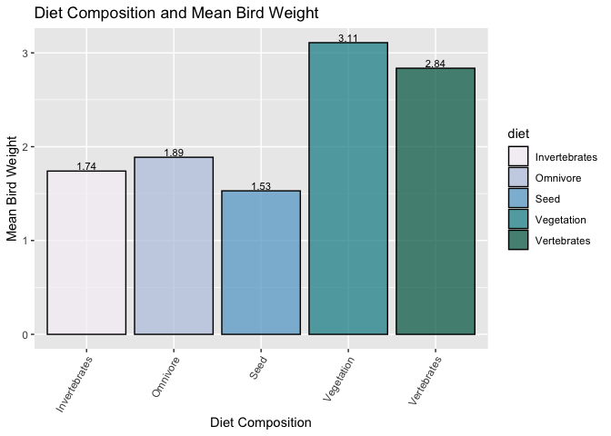

## R Markdown

##Background and Analysis Goals 

For our project, we are interested in analyzing the life history traits of the winter birds in the "Population trends for North American winter birds based on hierarchical models". We seek to determine which combination of life history variables results in the lowest extinction risk of winter birds in the context of increasing concern with climate change. 

In this rmd file, we will specifically look at `Log10mass` and `Diet` from the `ecosphere` data. We seek to determine which family of birds has the lowest extinction risk only based on their survival ability from weight and diet composition. 

## Load the Libraries


```r
library("tidyverse")
```

```
## ── Attaching core tidyverse packages ──────────────────────── tidyverse 2.0.0 ──
## ✔ dplyr     1.1.4     ✔ readr     2.1.4
## ✔ forcats   1.0.0     ✔ stringr   1.5.1
## ✔ ggplot2   3.4.4     ✔ tibble    3.2.1
## ✔ lubridate 1.9.3     ✔ tidyr     1.3.0
## ✔ purrr     1.0.2     
## ── Conflicts ────────────────────────────────────────── tidyverse_conflicts() ──
## ✖ dplyr::filter() masks stats::filter()
## ✖ dplyr::lag()    masks stats::lag()
## ℹ Use the conflicted package (<http://conflicted.r-lib.org/>) to force all conflicts to become errors
```

```r
library("janitor")
```

```
## 
## Attaching package: 'janitor'
## 
## The following objects are masked from 'package:stats':
## 
##     chisq.test, fisher.test
```

```r
library("naniar")
library("RColorBrewer")
```

## Load the data


```r
ecosphere <- read_csv("ecosphere.csv") %>% clean_names()
```

```
## Rows: 551 Columns: 21
## ── Column specification ────────────────────────────────────────────────────────
## Delimiter: ","
## chr (10): Order, Family, Common Name, Scientific Name, Diet, Life Expectancy...
## dbl (11): log10(mass), Mean Eggs per Clutch, Mean Age at Sexual Maturity, Po...
## 
## ℹ Use `spec()` to retrieve the full column specification for this data.
## ℹ Specify the column types or set `show_col_types = FALSE` to quiet this message.
```

## Load the colors


```r
?RColorBrewer
```


```r
colors <- brewer.pal(9,"PuBuGn")
display.brewer.pal(9,"PuBuGn")
```

<!-- -->


```r
?RColorBrewer
```

## Understanding the Data Structure


```r
names(ecosphere)
```

```
##  [1] "order"                       "family"                     
##  [3] "common_name"                 "scientific_name"            
##  [5] "diet"                        "life_expectancy"            
##  [7] "habitat"                     "urban_affiliate"            
##  [9] "migratory_strategy"          "log10_mass"                 
## [11] "mean_eggs_per_clutch"        "mean_age_at_sexual_maturity"
## [13] "population_size"             "winter_range_area"          
## [15] "range_in_cbc"                "strata"                     
## [17] "circles"                     "feeder_bird"                
## [19] "median_trend"                "lower_95_percent_ci"        
## [21] "upper_95_percent_ci"
```


```r
glimpse(ecosphere)
```

```
## Rows: 551
## Columns: 21
## $ order                       <chr> "Anseriformes", "Anseriformes", "Anserifor…
## $ family                      <chr> "Anatidae", "Anatidae", "Anatidae", "Anati…
## $ common_name                 <chr> "American Black Duck", "American Wigeon", …
## $ scientific_name             <chr> "Anas rubripes", "Anas americana", "Buceph…
## $ diet                        <chr> "Vegetation", "Vegetation", "Invertebrates…
## $ life_expectancy             <chr> "Long", "Middle", "Middle", "Long", "Middl…
## $ habitat                     <chr> "Wetland", "Wetland", "Wetland", "Wetland"…
## $ urban_affiliate             <chr> "No", "No", "No", "No", "No", "No", "No", …
## $ migratory_strategy          <chr> "Short", "Short", "Moderate", "Moderate", …
## $ log10_mass                  <dbl> 3.09, 2.88, 2.96, 3.11, 3.02, 2.88, 2.56, …
## $ mean_eggs_per_clutch        <dbl> 9.0, 7.5, 10.5, 3.5, 9.5, 13.5, 10.0, 8.5,…
## $ mean_age_at_sexual_maturity <dbl> 1.0, 1.0, 3.0, 2.5, 2.0, 1.0, 0.6, 2.0, 1.…
## $ population_size             <dbl> NA, NA, NA, NA, NA, NA, NA, NA, NA, NA, NA…
## $ winter_range_area           <dbl> 3212473, 7145842, 1812841, 360134, 854350,…
## $ range_in_cbc                <dbl> 99.1, 61.7, 69.8, 53.7, 5.3, 0.5, 17.9, 72…
## $ strata                      <dbl> 82, 124, 37, 19, 36, 5, 26, 134, 145, 103,…
## $ circles                     <dbl> 1453, 1951, 502, 247, 470, 97, 479, 2189, …
## $ feeder_bird                 <chr> "No", "No", "No", "No", "No", "No", "No", …
## $ median_trend                <dbl> 1.014, 0.996, 1.039, 0.998, 1.004, 1.196, …
## $ lower_95_percent_ci         <dbl> 0.971, 0.964, 1.016, 0.956, 0.975, 1.152, …
## $ upper_95_percent_ci         <dbl> 1.055, 1.009, 1.104, 1.041, 1.036, 1.243, …
```

As shown above, we have a combination of categorical and continous data. This will allow us to perform a variety of analysis and representation of data on various graph types.


```r
miss_var_summary(ecosphere)
```

```
## # A tibble: 21 × 3
##    variable           n_miss pct_miss
##    <chr>               <int>    <dbl>
##  1 population_size       273    49.5 
##  2 habitat                14     2.54
##  3 order                   0     0   
##  4 family                  0     0   
##  5 common_name             0     0   
##  6 scientific_name         0     0   
##  7 diet                    0     0   
##  8 life_expectancy         0     0   
##  9 urban_affiliate         0     0   
## 10 migratory_strategy      0     0   
## # ℹ 11 more rows
```


```r
summary(ecosphere)
```

```
##     order              family          common_name        scientific_name   
##  Length:551         Length:551         Length:551         Length:551        
##  Class :character   Class :character   Class :character   Class :character  
##  Mode  :character   Mode  :character   Mode  :character   Mode  :character  
##                                                                             
##                                                                             
##                                                                             
##                                                                             
##      diet           life_expectancy      habitat          urban_affiliate   
##  Length:551         Length:551         Length:551         Length:551        
##  Class :character   Class :character   Class :character   Class :character  
##  Mode  :character   Mode  :character   Mode  :character   Mode  :character  
##                                                                             
##                                                                             
##                                                                             
##                                                                             
##  migratory_strategy   log10_mass    mean_eggs_per_clutch
##  Length:551         Min.   :0.480   Min.   : 1.000      
##  Class :character   1st Qu.:1.365   1st Qu.: 3.000      
##  Mode  :character   Median :1.890   Median : 4.000      
##                     Mean   :2.012   Mean   : 4.527      
##                     3rd Qu.:2.685   3rd Qu.: 5.000      
##                     Max.   :4.040   Max.   :17.000      
##                                                         
##  mean_age_at_sexual_maturity population_size     winter_range_area  
##  Min.   : 0.200              Min.   :    15000   Min.   :       11  
##  1st Qu.: 1.000              1st Qu.:  1100000   1st Qu.:   819357  
##  Median : 1.000              Median :  4900000   Median :  2189639  
##  Mean   : 1.592              Mean   : 18446745   Mean   :  5051047  
##  3rd Qu.: 2.000              3rd Qu.: 18000000   3rd Qu.:  6778598  
##  Max.   :12.500              Max.   :300000000   Max.   :185968946  
##                              NA's   :273                            
##   range_in_cbc        strata          circles       feeder_bird       
##  Min.   :  0.00   Min.   :  1.00   Min.   :   2.0   Length:551        
##  1st Qu.:  2.35   1st Qu.:  3.00   1st Qu.:  46.5   Class :character  
##  Median : 30.30   Median : 11.00   Median : 184.0   Mode  :character  
##  Mean   : 38.48   Mean   : 32.43   Mean   : 558.9                     
##  3rd Qu.: 72.95   3rd Qu.: 42.00   3rd Qu.: 661.0                     
##  Max.   :100.00   Max.   :159.00   Max.   :3202.0                     
##                                                                       
##   median_trend   lower_95_percent_ci upper_95_percent_ci
##  Min.   :0.739   Min.   :0.5780      Min.   :    0.798  
##  1st Qu.:0.993   1st Qu.:0.9675      1st Qu.:    1.011  
##  Median :1.009   Median :0.9930      Median :    1.027  
##  Mean   :1.016   Mean   :0.9857      Mean   :   33.709  
##  3rd Qu.:1.030   3rd Qu.:1.0140      3rd Qu.:    1.055  
##  Max.   :1.396   Max.   :1.3080      Max.   :18000.000  
## 
```

Through a combination of `miss_var_summary` and `summary` functions we can check there are no NA placeholders in the data. There does not seem to be unusual data values as indicated by the `summary` function. As such, we can assume all NA values are correclty accounted for with NA.

## Weight and Diet Analysis


```r
ecosphere %>% 
  select(order, family, common_name, diet, log10_mass) %>% 
  group_by(family) %>% 
  summarise(individuals_per_family=n()) %>% 
  arrange(desc(individuals_per_family))
```

```
## # A tibble: 74 × 2
##    family       individuals_per_family
##    <chr>                         <int>
##  1 Anatidae                         44
##  2 Emberizidae                      43
##  3 Parulidae                        31
##  4 Scolopacidae                     29
##  5 Picidae                          22
##  6 Tyrannidae                       22
##  7 Accipitridae                     20
##  8 Icteridae                        20
##  9 Laridae                          20
## 10 Corvidae                         17
## # ℹ 64 more rows
```

The Antidae and Emberizidae winter bird families are the most abundant in `ecosphere`. High signs of abundance is a good thing, this will be considered later on. 


```r
table(ecosphere$diet)
```

```
## 
##         Fruit Invertebrates        Nectar      Omnivore          Seed 
##            11           216            13           114            64 
##    Vegetation   Vertebrates 
##            31           102
```


```r
# Assuming 'ecosphere' is your dataset and 'diet' is a column representing the type of diet

ecosphere %>%
  ggplot(aes(x = diet, fill = diet)) +
  geom_bar(color = "black", alpha = 0.75) +
  geom_text(stat = "count", aes(label = ..count..), vjust = -0.5) +  # Add text labels
  scale_fill_brewer(palette = "PuBuGn") +
  theme_classic() +
  labs(
    title = "Diet Composition in Recorded Winter Birds",
    x = "Type of Diet",
    y = "Number of Individuals"
  )
```

```
## Warning: The dot-dot notation (`..count..`) was deprecated in ggplot2 3.4.0.
## ℹ Please use `after_stat(count)` instead.
## This warning is displayed once every 8 hours.
## Call `lifecycle::last_lifecycle_warnings()` to see where this warning was
## generated.
```

<!-- -->

We have a large abundance of Invertebrates in the data.

*Relationship between bird weight and diet* 
In the article, authors make note that bird species that are most prone to extinction events in the context of climate change are those larger in overall body weight. 


```r
ecosphere %>% 
  filter(family %in% c("Anatidae", "Emberizidae", "Parulidae", "Scolopacidae", "Picidae", "Tyrannidae", "Accipitridae", "Icteridae", "Laridae", "Corvidae")) %>% 
  ggplot(aes(x=diet,y=log10_mass,fill=diet))+
  geom_boxplot(color="black", alpha=0.75)+
  scale_fill_brewer(palette ="PuBuGn")+ #why is color not working
  theme(axis.text.x = element_text(angle = 60, hjust=1))+
  labs(title="Diet Composition and Bird Weight",
       x= "Type of Diet",
       y="Bird Weight")
```

<!-- -->

This graph makes it clear that winter birds who rely on nectar as a food source, have significantly smaller weights. While this does not mean this winter bird is doing poor, it demonstrates a difference in survival tactics depending on the diet. In the context of climate change, flowering plants are expected to do poor in habitats with rising temperatures. While more flowers are found to bloom with warmer temperatures, the amount of nectar found is not increasing proportionally. Thus suggesting a decrease in food, which is bound to have negative impacts for winter birds that depend on nectar for survival. From this fact, nectar dependent birds will be excluded from being bird species `less` vulnerable to extinction on the basis of weight.

Determining average weight per diet. Mass is assumed to be recorded in grams, note that weight is measured in log10 scale. 

```r
ecosphere %>% 
  group_by(diet) %>% 
  summarise(mean_weight=mean(log10_mass))
```

```
## # A tibble: 7 × 2
##   diet          mean_weight
##   <chr>               <dbl>
## 1 Fruit               1.97 
## 2 Invertebrates       1.73 
## 3 Nectar              0.604
## 4 Omnivore            1.89 
## 5 Seed                1.64 
## 6 Vegetation          3.04 
## 7 Vertebrates         2.85
```

```r
ecosphere %>%
  filter(family %in% c("Anatidae", "Emberizidae", "Parulidae", "Scolopacidae", "Picidae", "Tyrannidae", "Accipitridae", "Icteridae", "Laridae", "Corvidae")) %>% 
  group_by(diet) %>%
  summarise(mean_weight = mean(log10_mass)) %>%
  ggplot(aes(x = diet, y = mean_weight, fill = diet)) +
  geom_col(color = "black", alpha = 0.75) +
  scale_fill_brewer(palette = "PuBuGn") +
  theme(axis.text.x = element_text(angle = 60, hjust = 1)) +
  labs(
    title = "Diet Composition and Mean Bird Weight",
    x = "Diet Composition",
    y = "Mean Bird Weight"
  ) +
  geom_text(aes(label = round(mean_weight, 2)), vjust = -0.2, size = 3, color = "black")
```

<!-- -->


```r
ecosphere %>% 
  filter(habitat!= "NA") %>% 
  ggplot(aes(x=diet,y=log10_mass,fill=diet))+
  geom_boxplot(position="dodge", color="black", alpha=0.75)+
  scale_fill_brewer(palette ="PuBuGn")+
  theme(axis.text.x = element_text(angle = 60, hjust=1))+
  labs(title="Diet Composition and Bird Weight",
       x= "Diet Composition",
       y="Bird Weight")+
  facet_wrap(~habitat)
```

<!-- -->

From the prior graph, we learn that birds with the highest body weight are those reliant on vegation and invertebrates have the highest log10mass. 


```r
ecosphere %>% 
  select(order, family, common_name, diet, log10_mass) %>%
  filter(diet== "Vegetation" | diet=="Vertebrates" | diet=="Nectar") %>% 
  ggplot(aes(x=order,fill=diet))+
  geom_bar(position="dodge",color="black", alpha=0.75)+
  scale_fill_brewer(palette ="PuBuGn")+
  theme(axis.text.x = element_text(angle = 60, hjust=1))+
  facet_wrap(~diet)
```

<!-- -->

In the study, authors conclude that body size can influence the survival status of birds, with larger bodied taxa being at higher risk. In terms of diet, taxa that occupy higher tropic levels face elevated risk of extinction. 

